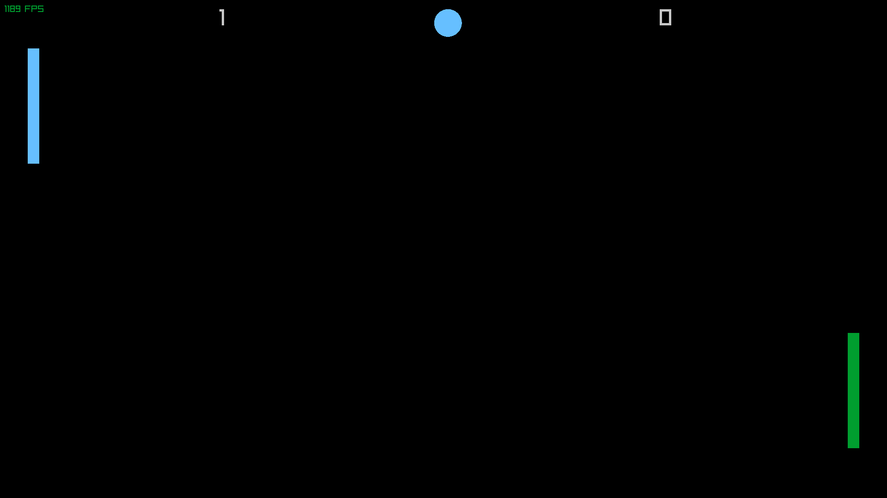

# 🏓 PingPong

A simple Pong-style game built with [raylib](https://www.raylib.com/).  
Play against a friend and relive the classic arcade vibes.

Included cmakelists if using Clion.

---

## 🎮 Screenshots

<p align="center">
  
  
  
</p>

---

## 🕹️ Controls
- **W / S** → Move left paddle  
- **Up / Down** → Move right paddle  

---

## Clone the repo:
```bash
git clone https://github.com/CODED-DIGNITY/PingPong.git
cd PingPong
